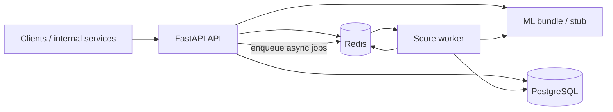

# Fraud Detection API

Production-style **real-time fraud scoring** service: a FastAPI backend that scores transactions with **scikit-learn / XGBoost** pipelines, persists results in **PostgreSQL**, uses **Redis** for repeat lookups (after the database authorizes the `transaction_id`), and optionally processes high-volume scoring through a **background worker** fed by a Redis queue.

---

## Project overview

This repository is an end-to-end **fintech risk** slice: ingest a transaction, run ML inference (or a deterministic **stub** when no model bundle is configured), store the transaction and `model_predictions` row, expose **read APIs** for operations and analytics, and support **synchronous** (`200`) or **asynchronous** (`202` + worker) scoring paths.

Design goals reflected in the code: strict **input validation** (Pydantic), **duplicate protection** (business `transaction_id`), **observability** (structured logging, request IDs), and **defensive API defaults** (body size limits, sliding-window rate limits, readiness checks).

---

## Why this matters in fintech

Payment fraud drives **chargebacks**, **customer churn**, and **regulatory scrutiny**. Systems that score transactions in milliseconds—with **audit-friendly** stored predictions and explainability hooks—let risk teams automate decisions, tune thresholds, and investigate cases without rebuilding pipelines ad hoc. This project demonstrates how that capability maps to a **service-oriented** architecture: API ↔ cache ↔ database ↔ optional async worker, with a clear path from **training artifacts** to **served inference**.

---

## Architecture overview



| Layer | Role |
|--------|------|
| **API** | `POST /api/v1/fraud/score`, `POST .../score-async`, transaction and prediction read APIs, `/health` and `/health/ready`. |
| **PostgreSQL** | Canonical store for transactions and model prediction history (SQLAlchemy 2 + Alembic migrations). |
| **Redis** | Fraud score **cache** (TTL-backed) and **FIFO job queue** (`LPUSH` / `BRPOP`) for async scoring. |
| **Worker** | `python -m app.workers.fraud_score_worker` — consumes queue jobs and reuses the same scoring service as the API. |
| **ML** | `FraudPredictor` loads a **joblib** training bundle from `MODEL_BUNDLE_PATH` or falls back to a **stub** for local/dev and tests. |

OpenAPI docs are served at **`/docs`** when the API is running.

---

## Tech stack

- **Language & runtime:** Python 3.11  
- **Web:** FastAPI, Uvicorn  
- **Data & ORM:** PostgreSQL, SQLAlchemy 2, Alembic, psycopg2  
- **Cache & queue:** Redis  
- **ML:** pandas, NumPy, scikit-learn, XGBoost, joblib  
- **Config & validation:** pydantic-settings, Pydantic v2  
- **Observability:** structlog (JSON-friendly structured logs)  
- **Deployment:** Docker, Docker Compose  

---

## Key features

- **Synchronous fraud scoring** with persisted transaction + prediction rows and optional **risk explanation** payload (compatible with SHAP-style factor lists when using a trained bundle).  
- **Asynchronous scoring** via Redis queue and a dedicated worker process (same business logic as sync).  
- **Redis-backed score cache** for the same `transaction_id` once the row matches the request payload (configurable TTL); avoids recomputing identical retries.  
- **Read APIs:** paginated transaction list with filters, transaction detail with full prediction history, recent predictions across all transactions.  
- **Operational hardening:** max request body size, per-route rate limits, `X-Request-ID`, `/health` vs `/health/ready` (DB + Redis).  
- **ML training CLI:** trains **Logistic Regression** and/or **XGBoost**, writes versioned **bundle + metadata** under `app/ml/artifacts/`.  

---

## Example API requests & responses

### Health

```http
GET /health
```

```json
{ "status": "healthy" }
```

```http
GET /health/ready
```

```json
{
  "status": "ready",
  "database": "connected",
  "redis": "connected"
}
```

### Score a transaction (synchronous)

`transacted_at` must be **timezone-aware** (ISO 8601). For tabular models trained on datasets like Kaggle’s *Credit Card Fraud Detection*, pass engineered columns under `model_features` (e.g. `V1`…`V28`) as required by your bundle.

```http
POST /api/v1/fraud/score
Content-Type: application/json
```

```json
{
  "transaction_id": "txn_20250324_001",
  "customer_id": "cus_8821",
  "amount": "129.99",
  "merchant": "Example Merchant",
  "category": "retail",
  "country": "US",
  "city": "Seattle",
  "device_type": "mobile",
  "ip_address": "203.0.113.10",
  "transacted_at": "2025-03-24T15:30:00+00:00"
}
```

**Example response** (shape; exact scores depend on model or stub):

```json
{
  "fraud_score": 0.073,
  "predicted_label": "legit",
  "model_version": "stub-v1",
  "risk_explanations": null,
  "transaction_internal_id": "6ba7b810-9dad-11d1-80b4-00c04fd430c8",
  "transaction_id": "txn_20250324_001",
  "prediction_id": "6ba7b811-9dad-11d1-80b4-00c04fd430c8",
  "latency_ms": 12,
  "cached": false,
  "scored_at": "2025-03-24T15:30:01.123456+00:00"
}
```

Re-using the same `transaction_id` with **different** persisted fields (amount, customer, timestamp, etc.) returns **`409 Conflict`** with `reason: transaction_id_reuse_with_different_payload`. **Identical** retries hit Redis (or the database replay path if the cache expired).

### Queue scoring (asynchronous)

```http
POST /api/v1/fraud/score-async
Content-Type: application/json
```

Same JSON body as sync. **Response:**

```json
{
  "status": "accepted",
  "transaction_id": "txn_20250324_001",
  "message": "Transaction queued for background fraud scoring."
}
```

Run the **`worker`** service (see Compose) so jobs are drained from Redis.

### List transactions

```http
GET /api/v1/transactions?limit=20&offset=0&country=US
```

Response includes `items` (summaries with optional `latest_prediction_label`) and `pagination` (`limit`, `offset`, `total`).

### Transaction detail

```http
GET /api/v1/transactions/txn_20250324_001
```

Returns `transaction` plus a `predictions` array (full history for that business id).

### Recent predictions

```http
GET /api/v1/predictions/recent?limit=20&offset=0
```

**Demo traffic:** from the repo root, `python scripts/demo_api_requests.py` posts rows from `data/demo/transactions.json` to the sync or async endpoint.

---

## Local setup

### Prerequisites

- Docker & Docker Compose **or** Python 3.11+, local PostgreSQL 16+, and Redis 7+  
- Copy **`.env.example`** → **`.env`** and adjust ports if needed (`HOST_API_PORT`, `HOST_POSTGRES_PORT`, `HOST_REDIS_PORT`)

### Option A — Docker Compose (recommended)

From the repository root:

```bash
docker compose up --build -d
docker compose run --rm api alembic upgrade head
```

- API: `http://localhost:8000` (override with `HOST_API_PORT`)  
- Interactive docs: `http://localhost:8000/docs`  

Optional: load synthetic demo rows (uses `DATABASE_URL` pointing at your mapped Postgres port):

```bash
pip install -r requirements.txt
python scripts/seed_postgres.py --file data/demo/transactions.json
```

To use a **trained bundle** inside containers, set `MODEL_BUNDLE_PATH` in `.env` to a path **inside the image** (e.g. mount a volume or bake artifacts into a custom image). Without it, the API uses the **stub** predictor and remains fully functional for integration testing.

### Option B — Run the API on the host

1. Start PostgreSQL and Redis; set `DATABASE_URL` and `REDIS_URL` in `.env` (see `.env.example`).  
2. Install dependencies: `pip install -r requirements.txt`  
3. `alembic upgrade head`  
4. `uvicorn app.main:app --reload --host 0.0.0.0 --port 8000`  
5. In another terminal, run the worker if you use async scoring: `python -m app.workers.fraud_score_worker`  

---

## Model training instructions

Training expects a **CSV** and an optional **DatasetSpec** JSON (defaults to the packaged `creditcard` spec when present). The canonical example is the Kaggle **Credit Card Fraud Detection** dataset (`creditcard.csv`); download it and place it under e.g. `./data/creditcard.csv` (not committed here).

From the **repository root**:

```bash
python -m app.ml.train --data-path ./data/creditcard.csv --model both
```

Flags (see `app/ml/train.py`):

- `--spec-path` — custom `DatasetSpec` JSON  
- `--output-dir` — default `app/ml/artifacts`  
- `--model` — `logistic_regression` | `xgboost` | `both`  
- `--model-version` — override version string (default: UTC timestamp + short git SHA)  
- `--random-state`, `--test-size` — reproducibility / holdout split  

The command prints JSON with **`bundle_path`**, **`metadata_path`**, and **`metrics_test`** per run. Point **`MODEL_BUNDLE_PATH`** at the generated `*_bundle.joblib` file to serve that model in the API and worker.

---

## Running tests

Install app + dev dependencies from the repo root:

```bash
pip install -r requirements.txt
pip install -r requirements-dev.txt
```

Tests use **SQLite** (in-memory) and **fakeredis**; they do **not** require live Postgres or Redis.

```bash
python -m pytest
```

Useful variants:

```bash
python -m pytest tests/ -q
python -m pytest tests/test_fraud_score_api.py -v
```

See [`tests/README.md`](tests/README.md) for fixture notes, rate-limit behavior under test, and an optional Docker one-liner for CI-like runs.

---

## Limitations

- **No API authentication** — suitable for demos; a real deployment would sit behind a gateway or add OAuth2/mTLS.  
- **Rate limits are in-process** — effective per API replica unless moved to Redis or the edge.  
- **Async jobs** — after a worker dequeues a job, failures are not automatically retried or dead-lettered.  
- **Inference threshold** — binary decisions use a fixed **0.5** probability cutoff unless you change `FraudPredictor` or calibrate in training metadata.  
- **Payload matching for `transaction_id`** — conflict detection compares **persisted transaction columns**, not `model_features`; two calls with the same id and same core fields but different `model_features` are treated as the same logical transaction.  
- **Redis cache without a DB row** — if the cache has an entry but Postgres does not (unusual), the API may return that cached score until TTL expires.

---

## Future improvements

- **Distributed rate limiting** (Redis or gateway) for multi-replica APIs  
- **Metrics and tracing** (OpenTelemetry, Prometheus) on top of existing structured logs  
- **Shadow / champion–challenger** deployment and automated drift checks  
- **Batch scoring** and file-based replay for backfills  
- **Authn/z** (OAuth2, mTLS) for external exposure  
- **Feature store** integration for consistent offline/online features  

---

## Resume-ready highlights

- Built a **FastAPI** fraud-scoring service with **PostgreSQL** persistence, **Redis** caching, and an **async worker** backed by a Redis queue.  
- Implemented **ML training and inference** pipelines using **scikit-learn** and **XGBoost**, with **versioned joblib bundles**, metadata, and a safe **stub** fallback for development.  
- Applied **Pydantic**-driven validation, **Alembic** migrations, **duplicate-transaction** handling, and **read-optimized** list/detail APIs for transactions and predictions.  
- Added **operational controls**: structured logging, readiness probes, request size limits, and sliding-window **rate limiting**.  
- Wrote a **broad pytest suite** (API, services, cache, ML loading) using isolated test doubles.  

---

## What I learned

Shipping a fraud API is less about picking a single algorithm and more about **glue**: making sure the same scoring logic runs in the **request path** and the **worker**, that **ids and timestamps** are validated hard enough to catch bad upstream data, and that **observability** and **failure modes** (stub model, 409 on duplicates, 503 when the bundle cannot load) are explicit. Training on a real tabular fraud CSV drove home how much **feature contract** discipline matters—if production payloads do not match training columns, the best model in the world only produces support tickets.

---

## License
